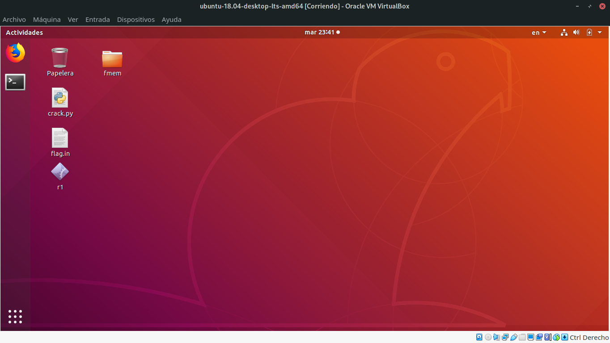
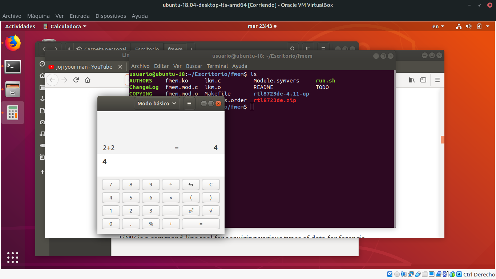
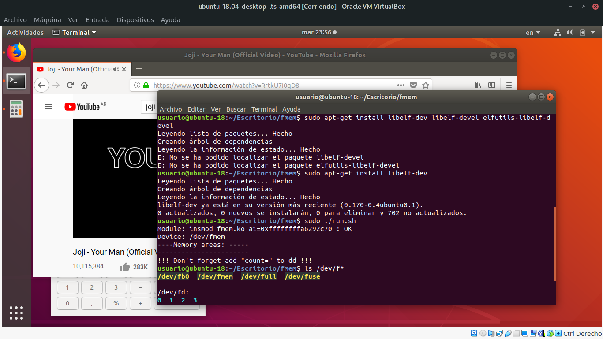
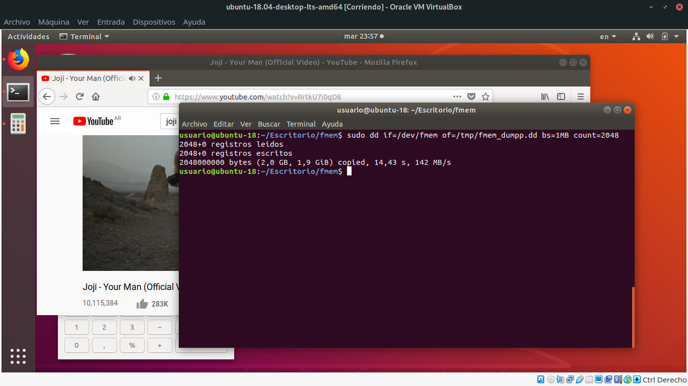
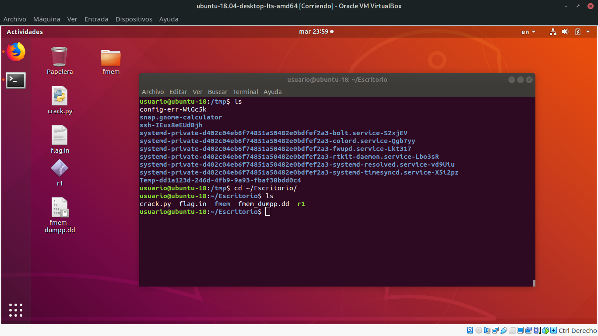
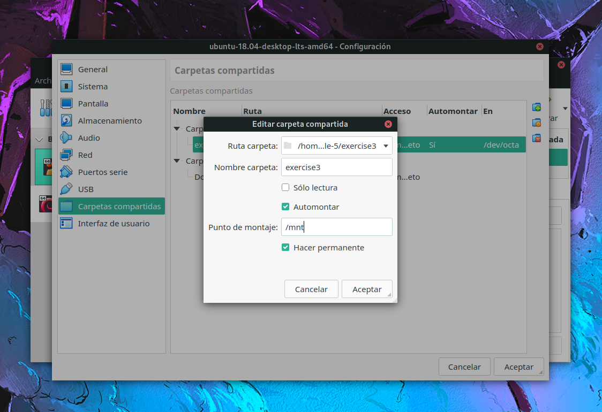
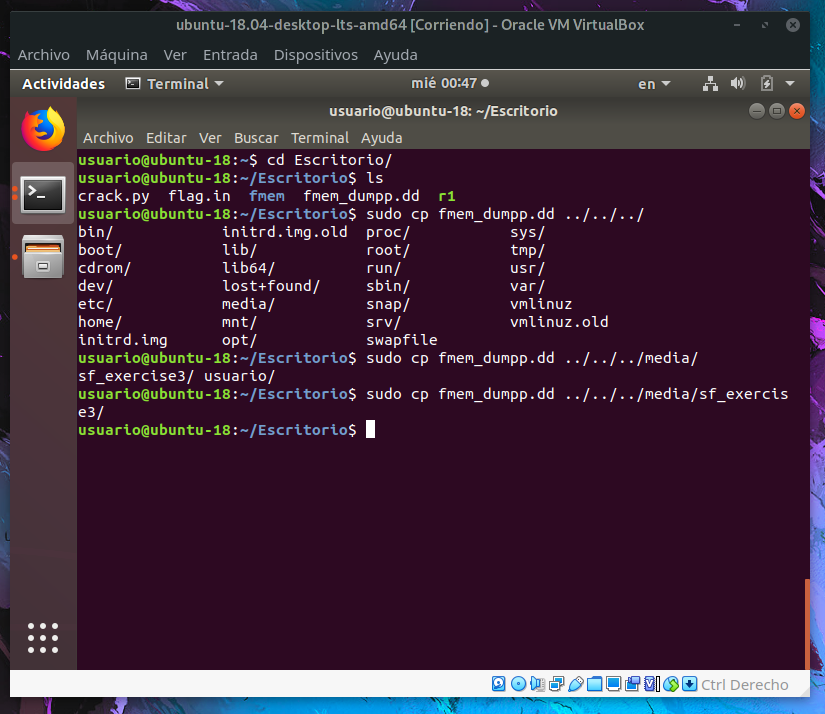
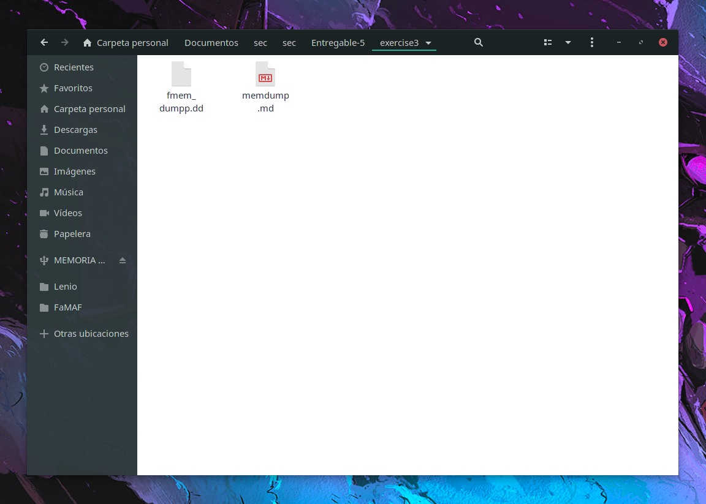

# Memdump analysis en Linux

## **LiME**
[LiME](https://github.com/504ensicsLabs/LiME) (Linux Memory Extractor) es una tool que nos permite realizar una snapshot de la memoria volátil de un dispositivo que corra un sistema operativo basado en Linux, tal como Ubuntu, Debian, Manjaro, o incluso Android...

Esta tool además permite hacer un dumpeo de memoria directamente al filesystem (o sea, al mismo dispositivo), o mandarlo a travez de internet a otro dispositivo, generalmente la estación de trabajo forense.

## **Linux Memory Grabber**
[LMG](https://github.com/halpomeranz/lmg) es una tool que nos permite crear perfiles de memoria desde un pen-drive, usando LiME, sin siquiera instalarlo.

## **fmem**
[fmem](https://github.com/NateBrune/fmem) es un módulo de kernel que crea un dispositivo en `/dev/fmem`, similar a `/dev/mem`, pero sin las limitaciónes que tiene normalmente `/dev/mem`, el cual tien un rango de addresses restringido. Por lo tanto `/dev/fmem` tiene acceso completo a la memoria física del sistema.

Entonces, usando comandos como dd, podemos copiar toda la memoria del dispositivo a analizar.

---

## Creacion de un memory dump

Ahora vamos a proceder a generar un memory dump de una maquina virtual con Ubuntu 18.04 lts :D

El primer paso es correr nuestra maquina virtual:

Tiene un par de archivos del ejercicio anterior, porque no pude hacer andar angr en mi sistema operativo :\

Anyways, instalamos fmem, como dice la documentación, y abro un par de aplicaciones para llenar la memoria de cosas, y que sea mas divertido analizar el dump.

Hacemos un ls a `/dev/f*` para ver si existe `/dev/fmem`, y lo vemos, asi que por ahora va todo bien.

Como ya vimos que fmem se corrio satisfactoriamente, podemos hacer lo que vinimos a hacer, dumpear la memoria con `dd`...
Corremos el comando:

> sudo dd if=/dev/fmem of/tmp/fmem_dumpp.dd bs=1MB count=2048

para extraer 2GB de ram en nuestro archivo.

* **if**: dice desde donde va a salir el archivo
* **fo**: es el output file en el que vas a escribir el dumpeo
* **count**: es la cantidad de memoria que queres leer

Como dice fmem cuando lo corres, si no especificas el count, va a leer infinitamente la memoria.

Luego verificamos el archivo, y lo vemos en `/tmp`, asi que lo movemos al escritorio para tenerlo a mano.

Creamos una carpeta compartida desde nuestra maquina en VirtualBox, para poder extraer el dump de memoria.

Y finalmente copiamos el dump a nuestra computadora, para extraerlo de la maquina virtual.

Y tadaaaa, lo tenemos en exercise3!

Notita: No lo voy a subir al repo porque son 2gb, pero capaz se pueda enviar por discord jajaja